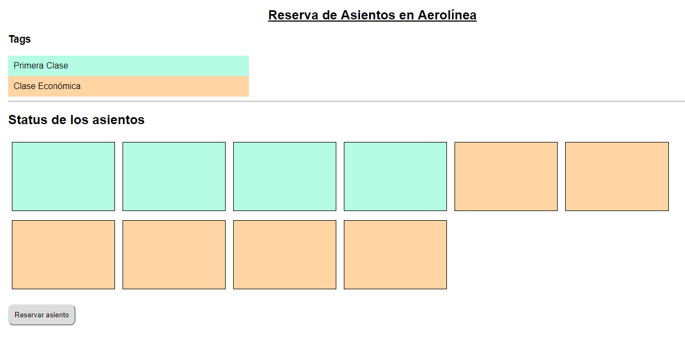

# Reserva de asientos en aerolínea #

Una pequeña aerolínea acaba de comprar una computadora para su nuevo sistema de reservaciones automatizadas. 
El proyecto consiste en desarrollar un nuevo sistema. Para ello, se creará una aplicación para asignar asientos en cada vuelo del único avión de la aerolínea (capacidad: 10 asientos).

Acontinuación una vista de la aplicación:

### Entregables ###

El repositorio de GitHub contiene:

1. Archivo README.md que contiene el diagrama de flujo
2. Archivo app.js con el código de la solución
3. Archivo index.html vinculado con el app.js
4. Archivo main.css vinculado con el index.html

### Diagrama de Flujo ###

